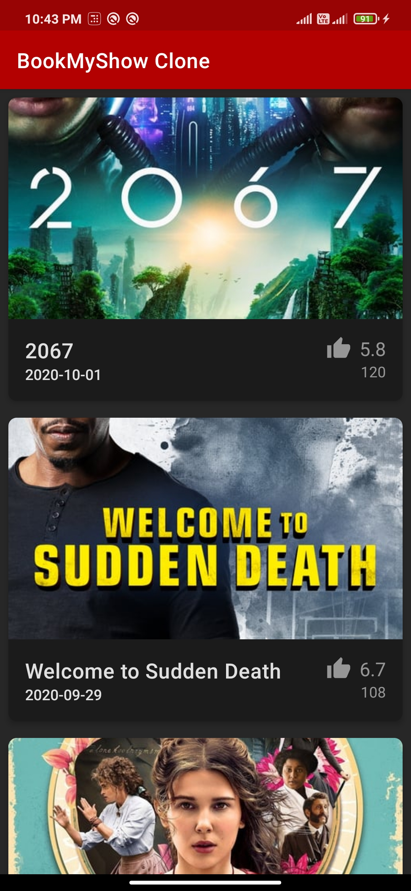

# BookMyShowClone

In DevFest India 2020, Android track built a BMS clone application using MVVM architecture. They also implemented data persistance via Room. 
This repo conisist of the same project that I built by following their instructions.

 

### Application Screenshot

 

### Libraries used - 
- Retrofit
- Gson
- Glide
- Room
- Lifecycle
- ViewModel
- Material Design

 
For original DevFest-2020 video, click below -

- [Day 1](https://www.youtube.com/watch?v=C8k9mdb9NE8&t=6167s)
- [Day 2](https://www.youtube.com/watch?v=chtdrBvJpZ4&t=7100s)
- [Day 3](https://www.youtube.com/watch?v=chtdrBvJpZ4&t=7100s)
